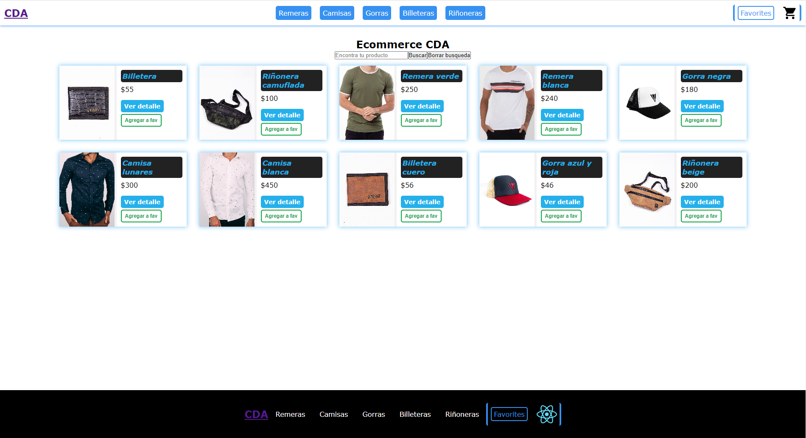

# Ecommerce CDA



[Demo del proyecto](https://ecommerce-cda.netlify.app/)

## Librerias utilizadas
- React-router-dom
- React-spinners
- Sweetalert2

## Levantar el proyecto

1. Clonar el repositorio 

```
git clone https://github.com/WalRol/e-commerce-cda.git
``` 
2. Instalar las dependencias

```
npm i
```
3. Correr el proyecto

```
npm start
```
